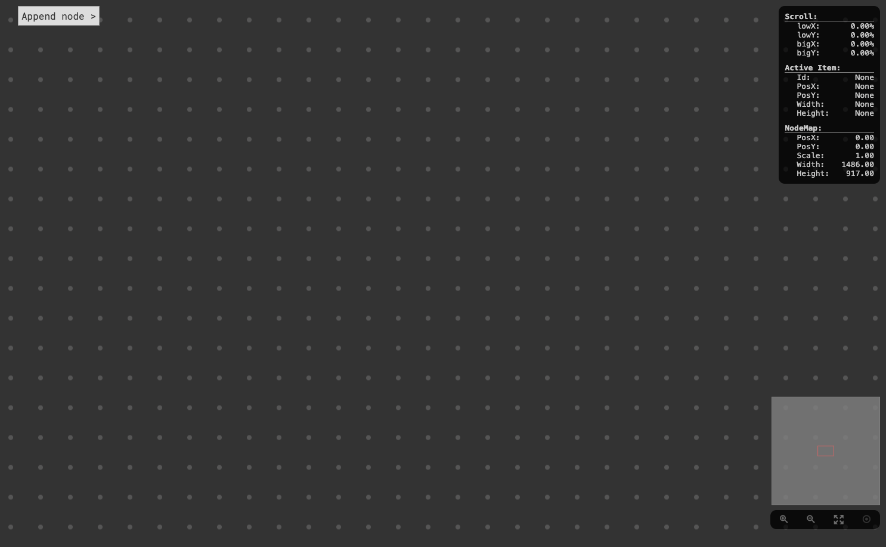
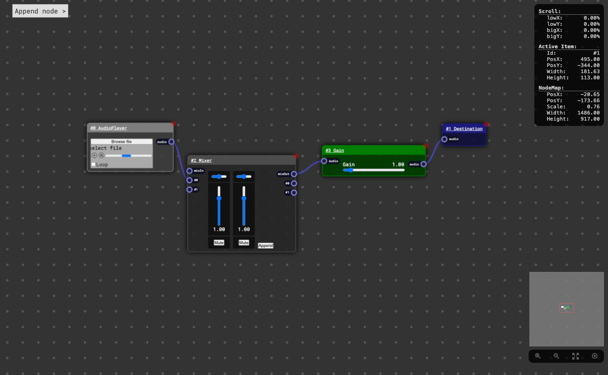
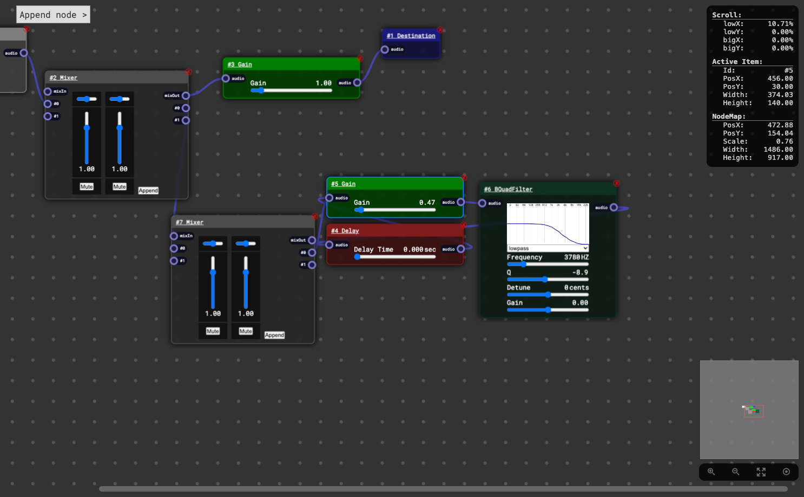
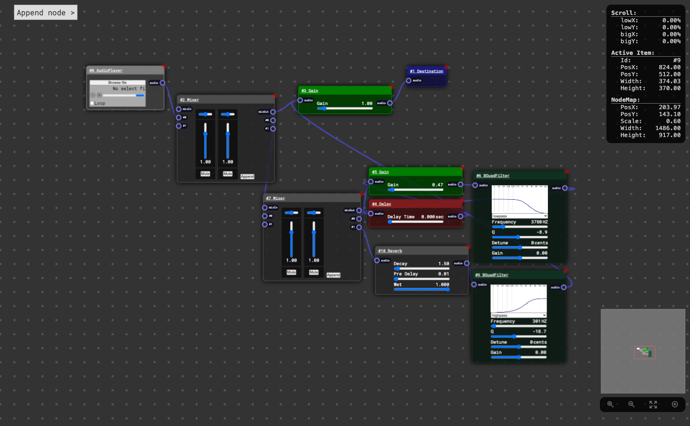

# NodeEditor

Графический редактор нод. Сейчас реализую новую версию с улучшенной архитектурой и пофикшеными багами. А пока решил залить демку на этом. Зайти можно [сюда](https://vicimpa.github.io/node-editor)

### Для запуска
```bash
> npm install
> npm run dev
```

### Для билда
```bash
> npm install
> npm run build
```

### Скриншоты
>
> [](screens/screen1.png)
>

>
> [](screens/screen2.png)
>

>
> [](screens/screen3.png)
>

>
> [](screens/screen4.png)
>